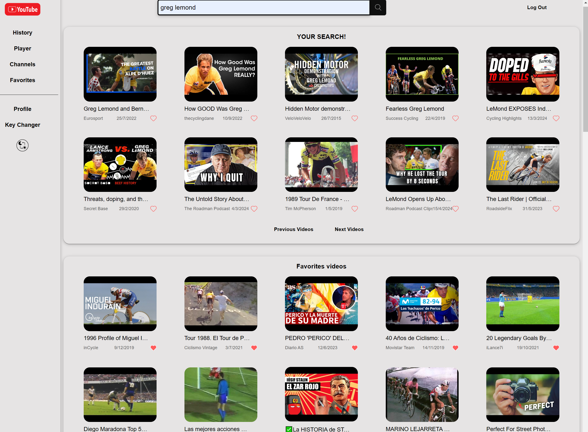
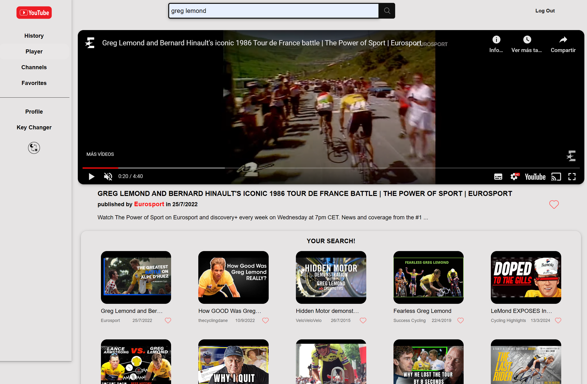

# React-YouTube


## Introducción

Explicación más detallada sobre el proyecto, su motivación y los problemas que intenta resolver.  

## Descripción del proyecto

React-Youtube es una aplicación web creada con React que emula las funcionalidades básicas de YouTube. Permite a los usuarios buscar videos, ver detalles de los videos, guardarlos como favoritos y reproducirlos. Este proyecto tiene como objetivo practicar y demostrar habilidades en React, integración con APIs y diseño de interfaces de usuario.

## Características

- Buscar videos utilizando la API de YouTube.   
        `<link>` : https://developers.google.com/youtube/v3/docs?hl=es  
         Referencia de API de YouTube:  
         `<link>` :https://developers.google.com/youtube/v3/docs  
         Ejemplos de llamadas API de Youtube:  
         `<link>` :https://developers.google.com/youtube/v3/sample_requests  

- Mostrar una lista de videos basados en los términos de búsqueda.
- Reproducir videos dentro de la aplicación.
- Mostrar detalles del video, incluyendo título, descripción y vistas.
- Guardar videos favoritos y mostrarlos en una lista.
- Visualizar detalles de un determinado channel de youtube y ver sus videos.
- Listado de los últimos channels visitados.
- Diseño responsive para dispositivos móviles y de escritorio.
- Dark mode.
- Uso de Skeletons para hacer más amigable la experiencia de usuario.
- Botón "Key Changer" para cambiar la API de Youtube si se excede su cuota de uso, entre 3 API's configuradas.
- Icono para hacer 'scroll on top' cada vez que sea necesario.

## Tecnologías Utilizadas

- **React**: Biblioteca de JavaScript para construir interfaces de usuario.
- **React Router**: Para la navegación entre diferentes páginas de la aplicación.
- **React Context**: Para pasar datos a través del árbol de componentes sin tener que pasar props manualmente en cada nivel.
- **LocalStorage Context**:  combina el uso de React Context con LocalStorage del navegador para crear métodos y gestionar el almacenamiento local del navegador.
- **Axios**: Cliente HTTP para realizar solicitudes a la API de YouTube.
- **API de YouTube**: Para obtener datos y videos.
- **Auth0**: Configuración y uso para realizar un Login con Google, extraer la información general de la cuenta y crear rutas protegidas.
- **Protected Route** Confuguración para crear rutas protegidas, acceso si se produce la autentificación.
- **SASS en React,** **Grid, Flexbox,** **CSS3** y **HTML5**: Para el diseño y estructura de la aplicación.
- **React Skeleton**: Para crear un efecto de carga de datos en la aplicación.
- **BEM**: metodología de nomenclatura y estructura de código CSS. Ayuda a reutilizar estilos, facilita el mantenimiento y hace que los estilos sean más escalables en proyectos web.  
- **React Helmet Async**: Para implementar SEO y Opengraph.

// FALSO
- **React Icons**: Para agregar iconos a la aplicación.
- **React Toastify**: Para mostrar mensajes de éxito y error en la aplicación.
- **React Hook Form**: Para crear formularios en React.
- **React Hook Form Resolvers**: Para validar formularios en React.
- **React Hook Form Validation**: Para validar formularios en React.

## Estructura de archivos

```
react-youtube/
├── public/
│   ├── index.html
│   └── ...
├── src/
│   ├── app/
│   │   ├── Router.js
│   │   └── ProtectedRoute.js
│   ├── components/
│   │   ├── VideoDetail.js
│   │   ├── VideoList.js
│   │   ├── VideoItem.js
│   │   └── ...
│   ├── pages/
│   │   ├── HomePage.js
│   │   ├── History.js
│   │   └── ...
│   ├── App.js
│   ├── index.js
│   ├── services/
│   │   └── GeYoutube.js
│   ├── scss/
│   │   ├── _variables.scss
│   │   ├── _mixins.scss
│   │   └── ...
│   │   └── main.scss
│   │   └── ...
│   └── ...
├── .env
├── package.json
└── README.md
```


## Uso 

- Buscar Videos:
      Utiliza la barra de búsqueda para ingresar términos de búsqueda.
      La aplicación mostrará una lista de videos relacionados con el término de búsqueda.
- Reproducir Videos: 
      Haz clic en un video de la lista para ver los detalles y reproducir el video.

- Agregar un video como favorito:
      Haz clic en el botón de favorito para agregar un video a la lista de favoritos.
- Visualizar todos los videos favoritos como una lista.
- Revisar las últimas 10 búsquedas realizadas en la página, con posibilidad de recarga.
- Visualizar los canales a los que pertenecen los videos mostrados. 
- Revisar los últimos canales buscados y ver los videos de dicho canal.  
`